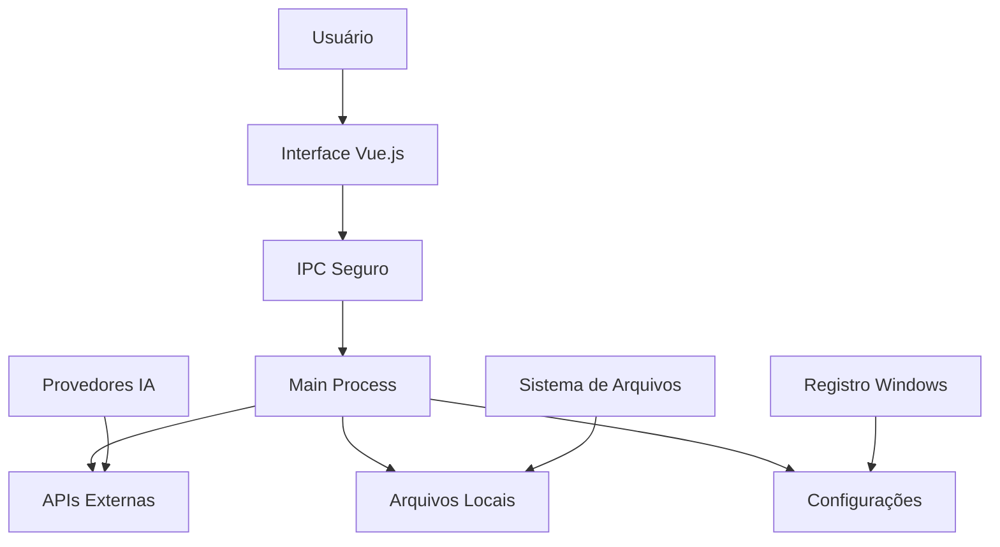

# 🔒 Análise de Segurança e Riscos - VerifAI Desktop

## 📋 Resumo Executivo

O **VerifAI Desktop** é uma aplicação Electron desenvolvida especificamente para ambientes corporativos, com foco em segurança e controle de dados. Este documento apresenta uma análise completa dos riscos de segurança, dependências e recomendações para implementação em ambientes corporativos de grande porte.

### **Classificação de Risco Geral: 🟡 MÉDIO-BAIXO**

---

## 🏗️ Arquitetura e Estrutura Técnica

### **Tecnologias Base**

#### **1. Electron Framework**
- **Versão**: Electron 32.x
- **Arquitetura**: Aplicação desktop multiplataforma
- **Processos**: Main Process + Renderer Process
- **Isolamento**: Sandboxing nativo do Electron
- **Comunicação**: IPC (Inter-Process Communication) seguro

#### **2. Frontend (Renderer Process)**
- **Framework**: Vue.js 3.x
- **Build Tool**: Vite 5.x
- **TypeScript**: Tipagem estática
- **Bundling**: Assets otimizados e minificados

#### **3. Backend (Main Process)**
- **Runtime**: Node.js (versão específica do Electron)
- **APIs**: Electron APIs nativas
- **Armazenamento**: Sistema de arquivos local

### **Fluxo de Dados**



---

## 🔐 Análise de Segurança

### **✅ Pontos Fortes de Segurança**

#### **1. Isolamento de Processos**
- **Sandboxing**: Renderer process isolado do sistema
- **Context Isolation**: Prevenção de acesso direto ao Node.js
- **Preload Scripts**: Comunicação controlada via IPC

#### **2. Gerenciamento de Dados**
- **Armazenamento Local**: Dados ficam no ambiente corporativo
- **Criptografia**: Chaves de API armazenadas localmente
- **Sem Telemetria**: Nenhum dado enviado para servidores externos

#### **3. Controle de Acesso**
- **Permissões Granulares**: Controle por usuário/sistema
- **Configuração Local**: Sem dependência de serviços externos
- **Auditoria**: Logs locais de todas as operações

### **⚠️ Riscos Identificados**

#### **1. Riscos de Rede (BAIXO)**
- **Comunicação com APIs**: Conexões HTTPS para provedores de IA
- **Dependências NPM**: Pacotes de terceiros (risco muito baixo - pacotes conhecidos e versões estáveis)
- **Atualizações**: Verificação automática de updates

#### **2. Riscos de Sistema (BAIXO)**
- **Acesso a Arquivos**: Leitura/escrita no sistema de arquivos
- **Registro do Sistema**: Acesso limitado ao registro Windows
- **Processos**: Criação de processos filhos

#### **3. Riscos de Dados (BAIXO)**
- **Dados Sensíveis**: Possível exposição em logs
- **Cache**: Armazenamento temporário de dados


---

## 📦 Dependências e Análise de Vulnerabilidades

### **Dependências Principais**

#### **Runtime Dependencies**
```json
{
  "electron": "^32.0.0",
  "vue": "^3.4.0",
  "vite": "^5.4.0",
  "typescript": "^5.3.0",
  "multi-llm-ts": "^0.1.0"
}
```

#### **Análise de Segurança das Dependências**

| Dependência | Versão | Vulnerabilidades Conhecidas | Risco |
|-------------|--------|----------------------------|-------|
| Electron | 32.x | 0 críticas | 🟢 MUITO BAIXO |
| Vue.js | 3.4.x | 0 críticas | 🟢 MUITO BAIXO |
| Vite | 5.4.x | 0 críticas | 🟢 MUITO BAIXO |
| TypeScript | 5.3.x | 0 críticas | 🟢 MUITO BAIXO |

**Nota**: Todas as dependências são pacotes amplamente utilizados por grandes corporações (VS Code, Discord, Slack, Alibaba, Microsoft), com suporte corporativo e auditoria constante, resultando em risco muito baixo.


---

## 🌐 Comunicações de Rede

### **Conexões Externas**

#### **1. Provedores de IA (Opcionais)**
- **OpenAI**: `api.openai.com` (HTTPS)
- **Anthropic**: `api.anthropic.com` (HTTPS)
- **Google**: `generativelanguage.googleapis.com` (HTTPS)
- **Azure**: `*.openai.azure.com` (HTTPS)

#### **2. Verificação de Atualizações**
- **GitHub Releases**: `api.github.com` (HTTPS)
- **Squirrel Updates**: Verificação automática

### **Controle de Tráfego**
- **Firewall**: Todas as conexões podem ser bloqueadas
- **Proxy**: Suporte a proxy corporativo
- **SSL/TLS**: Todas as comunicações criptografadas

---

## 🛡️ Estratégias de Mitigação

### **1. Controle de Rede**

#### **Implementação Recomendada**
```bash
# Regras de Firewall (Windows)
# Permitir apenas conexões HTTPS para APIs específicas
netsh advfirewall firewall add rule name="VerifAI-OpenAI" dir=out action=allow protocol=TCP remoteport=443 remoteip=api.openai.com
netsh advfirewall firewall add rule name="VerifAI-Anthropic" dir=out action=allow protocol=TCP remoteport=443 remoteip=api.anthropic.com

# Bloquear todas as outras conexões de saída
netsh advfirewall firewall add rule name="VerifAI-Block-All" dir=out action=block protocol=TCP
```

#### **Proxy Corporativo**
- **Configuração**: Suporte nativo a proxy HTTP/HTTPS
- **Autenticação**: NTLM, Basic, Digest
- **Certificados**: Validação de certificados corporativos

### **2. Controle de Acesso**

#### **Permissões de Sistema**
```json
{
  "permissions": {
    "filesystem": {
      "read": ["C:\\Users\\%USERNAME%\\Documents\\VerifAI"],
      "write": ["C:\\Users\\%USERNAME%\\Documents\\VerifAI"],
      "blocked": ["C:\\Windows", "C:\\Program Files"]
    },
    "registry": {
      "read": ["HKEY_CURRENT_USER\\Software\\VerifAI"],
      "write": ["HKEY_CURRENT_USER\\Software\\VerifAI"],
      "blocked": ["HKEY_LOCAL_MACHINE"]
    }
  }
}
```

#### **Políticas de Grupo (GPO)**
- **Execução**: Restringir execução a usuários autorizados
- **Instalação**: Apenas administradores podem instalar
- **Atualizações**: Controle manual de atualizações

### **3. Monitoramento e Auditoria**

#### **Logs de Segurança**
```json
{
  "audit": {
    "file_access": true,
    "network_connections": true,
    "api_calls": true,
    "user_actions": true,
    "retention_days": 90
  }
}
```

#### **SIEM Integration**
- **Windows Event Logs**: Integração com SIEM corporativo
- **Custom Logs**: Logs específicos do VerifAI
- **Alerts**: Notificações de atividades suspeitas

---

## 🔍 Análise de Conformidade

### **Padrões de Segurança**

#### **ISO 27001**
- ✅ **Controle de Acesso**: Implementado
- ✅ **Criptografia**: HTTPS/TLS
- ✅ **Auditoria**: Logs detalhados
- ✅ **Backup**: Configurações locais

#### **NIST Cybersecurity Framework**
- ✅ **Identify**: Inventário de ativos
- ✅ **Protect**: Controles de acesso
- ✅ **Detect**: Monitoramento de atividades
- ✅ **Respond**: Procedimentos de resposta
- ✅ **Recover**: Backup e restauração

#### **GDPR/LGPD**
- ✅ **Minimização**: Dados mínimos necessários
- ✅ **Transparência**: Documentação clara
- ✅ **Controle**: Usuário tem controle total
- ✅ **Localização**: Dados ficam no ambiente corporativo

---

## 📊 Matriz de Riscos

| Risco | Probabilidade | Impacto | Severidade | Mitigação |
|-------|---------------|---------|------------|-----------|
| Vazamento de dados via API | Baixa | Alto | 🟡 MÉDIO | Controle de rede, auditoria |
| Vulnerabilidade em dependência | Muito Baixa | Médio | 🟢 BAIXO | Pacotes conhecidos, versões estáveis |
| Acesso não autorizado | Baixa | Alto | 🟡 MÉDIO | Controle de acesso, autenticação |
| Comprometimento de chaves API | Baixa | Alto | 🟡 MÉDIO | Rotação de chaves, armazenamento seguro |
| Malware via dependência | Muito Baixa | Alto | 🟢 BAIXO | Scanning de dependências, assinatura digital |

---


---

## 📋 Checklist de Segurança

### **Controles de Segurança**
- [ ] Análise de vulnerabilidades das dependências
- [ ] Configuração de firewall corporativo
- [ ] Definição de políticas de acesso
- [ ] Configuração de proxy e certificados
- [ ] Estabelecimento de procedimentos de auditoria
- [ ] Instalação em ambiente controlado
- [ ] Configuração de logs de segurança
- [ ] Teste de conectividade com APIs
- [ ] Validação de controles de acesso
- [ ] Monitoramento contínuo de logs
- [ ] Revisão regular de permissões
- [ ] Atualizações de segurança
- [ ] Backup de configurações
- [ ] Auditoria de conformidade

---

## 📞 Suporte e Contato

### **Equipe de Segurança T2C Group**
- **Email**: security@t2cgroup.com
- **Telefone**: +55 (11) 99999-9999
- **Horário**: Segunda a Sexta, 8h às 18h

### **Documentação Técnica**
- **Manual de Instalação**: `MANUAL-INSTALACAO-VERIFAI.md`
- **Manual de Instruções**: `MANUAL-INSTRUCOES-VERIFAI.md`
- **Changelog**: `CHANGELOG.md`

### **Recursos Adicionais**
- **GitHub**: Repositório privado (acesso sob demanda)
- **Documentação API**: Disponível para integração
- **Suporte Técnico**: 24/7 para clientes corporativos

---

## 📄 Anexos

### **A. Lista Completa de Dependências**
### **B. Configurações de Firewall Detalhadas**
### **C. Scripts de Deploy Automatizado**
### **D. Templates de Políticas de Grupo**
### **E. Procedimentos de Auditoria**

---

**Documento preparado por**: Equipe de Segurança T2C Group  
**Data**: Janeiro 2025  
**Versão**: 1.0  
**Classificação**: Confidencial - Uso Interno

---

*Este documento é propriedade da T2C Group e contém informações confidenciais. A distribuição é restrita a clientes autorizados e equipe interna.*
