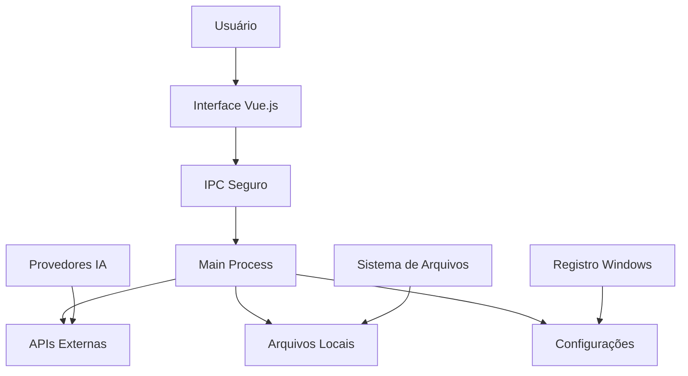

# 🔒 Análise Técnica e de Segurança - VerifAI Desktop


O **VerifAI Desktop** é uma aplicação Electron desenvolvida especificamente para ambientes corporativos, com foco em segurança e controle de dados. Este documento apresenta uma análise completa técnica e de segurança, dependências e recomendações para implementação em ambientes corporativos de grande porte.


---

## 🏗️ Arquitetura e Estrutura Técnica

### **Tecnologias Base**

#### **1. Electron Framework**
- **Versão**: Electron 32.x
- **Arquitetura**: Aplicação desktop multiplataforma
- **Processos**: Main Process + Renderer Process
- **Isolamento**: Sandboxing nativo do Electron
- **Comunicação**: IPC (Inter-Process Communication) seguro

#### **2. Frontend (Renderer Process)**
- **Framework**: Vue.js 3.x
- **Build Tool**: Vite 5.x
- **TypeScript**: Tipagem estática
- **Bundling**: Assets otimizados e minificados

#### **3. Backend (Main Process)**
- **Runtime**: Node.js (versão específica do Electron)
- **APIs**: Electron APIs nativas
- **Armazenamento**: Sistema de arquivos local

### **Fluxo de Dados**



---

## 🔐 Análise de Segurança


#### **1. Isolamento de Processos**
- **Sandboxing**: Renderer process isolado do sistema
- **Context Isolation**: Prevenção de acesso direto ao Node.js
- **Preload Scripts**: Comunicação controlada via IPC

#### **2. Gerenciamento de Dados**
- **Armazenamento Local**: Dados ficam no ambiente corporativo
- **Criptografia**: Chaves de API armazenadas localmente
- **Sem Telemetria**: Nenhum dado enviado para servidores externos

#### **3. Controle de Acesso**
- **Permissões Granulares**: Controle por usuário/sistema
- **Configuração Local**: Sem dependência de serviços externos
- **Auditoria**: Logs locais de todas as operações


#### **1. Riscos de Rede (BAIXO)**
- **Comunicação com APIs**: Conexões HTTPS para provedores de IA
- **Dependências NPM**: Pacotes de terceiros (risco muito baixo - pacotes conhecidos e versões estáveis)
- **Atualizações**: Verificação automática de updates (Desabilitado na Bayer)

#### **2. Riscos de Sistema (BAIXO)**
- **Acesso a Arquivos**: Leitura/escrita no sistema de arquivos
- **Registro do Sistema**: Acesso limitado ao registro Windows
- **Processos**: Criação de processos filhos

#### **3. Riscos de Dados (BAIXO)**
- **Dados Sensíveis**: Possível exposição em logs
- **Cache**: Armazenamento temporário de dados


---

## 📦 Dependências e Análise de Vulnerabilidades

### **Dependências Principais**

#### **Runtime Dependencies**
```json
{
  "electron": "^32.0.0",
  "vue": "^3.4.0",
  "vite": "^5.4.0",
  "typescript": "^5.3.0",
  "multi-llm-ts": "^0.1.0"
}
```


---

## 🌐 Comunicações de Rede

### **Conexões Externas**

#### **1. Provedores de IA (Opcionais)**(Caso Bayer - so existe um provedor interno da Bayer, todos os outros foram desabilitados)


#### **2. Verificação de Atualizações** (Desabilitado para Bayer)
- **GitHub Releases**: `api.github.com` (HTTPS)
- **Squirrel Updates**: Verificação automática

### **Controle de Tráfego**
- **Firewall**: Todas as conexões podem ser bloqueadas
- **Proxy**: Suporte a proxy corporativo
- **SSL/TLS**: Todas as comunicações criptografadas

---


### ** Controle de Acesso**

#### **Permissões de Sistema**
```json
{
  "permissions": {
    "filesystem": {
      "read": ["C:\\Users\\%USERNAME%\\Documents\\VerifAI"],
      "write": ["C:\\Users\\%USERNAME%\\Documents\\VerifAI"],
      "blocked": ["C:\\Windows", "C:\\Program Files"]
    },
    "registry": {
      "read": ["HKEY_CURRENT_USER\\Software\\VerifAI"],
      "write": ["HKEY_CURRENT_USER\\Software\\VerifAI"],
      "blocked": ["HKEY_LOCAL_MACHINE"]
    }
  }
}
```

## 🔍 Análise de Conformidade

### **Padrões de Segurança**

#### **ISO 27001**
- ✅ **Controle de Acesso**: Implementado
- ✅ **Criptografia**: HTTPS/TLS
- ✅ **Auditoria**: Logs detalhados
- ✅ **Backup**: Configurações locais

#### **NIST Cybersecurity Framework**
- ✅ **Identify**: Inventário de ativos
- ✅ **Protect**: Controles de acesso
- ✅ **Detect**: Monitoramento de atividades
- ✅ **Respond**: Procedimentos de resposta
- ✅ **Recover**: Backup e restauração

#### **GDPR/LGPD**
- ✅ **Minimização**: Dados mínimos necessários
- ✅ **Transparência**: Documentação clara
- ✅ **Controle**: Usuário tem controle total
- ✅ **Localização**: Dados ficam no ambiente corporativo

---

**Documento preparado por**: Equipe de Segurança T2C Group  
**Data**: Janeiro 2025  
**Versão**: 1.0  

*Este documento é propriedade da T2C Group e contém informações confidenciais. A distribuição é restrita a clientes autorizados e equipe interna.*
